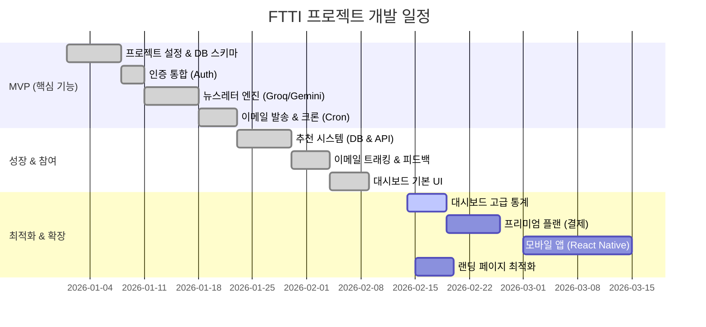

# 🎯 FTTI - AI 뉴스레터 큐레이션 서비스

**당신의 관심사를 AI가 매일 큐레이션합니다**

매일 오전 8시 또는 10시, 관심사 기반 맞춤형 뉴스레터를 이메일로 받아보세요.

[](https://vercel.com/new/clone?repository-url=https://github.com/dpdtydz/ftti)

---

## ✨ 주요 기능

### 📰 맞춤형 뉴스레터
- **AI 기반 큐레이션**: Groq Llama 3.1 8B, Gemini 2.0 Flash, Llama 3.3 70B 멀티 엔진
- **관심사 기반**: 최대 3개 관심사 선택 (IT, AI/ML, 경제, 스포츠 등)
- **다양한 소스**: 네이버 뉴스 API, GeekNews RSS, GitHub Trending
- **스마트 스케줄링**: 오전 8시 또는 10시 KST 중 선택 가능 (GitHub Actions 크론)

### 🎁 추천 프로그램 (Referral)
- **친구 초대 보상**:
  - 1명 초대 → 프리미엄 1주일 무료
  - 3명 초대 → 프리미엄 1개월 무료
  - 10명 초대 → 프리미엄 3개월 무료
- **추천 코드 자동 생성**
- **가입 시 자동 보상 처리**

### 📊 이메일 트래킹
- **오픈 트래킹**: 1x1 투명 픽셀로 이메일 열람 추적
- **클릭 트래킹**: 모든 링크 클릭 자동 기록
- **통계 대시보드**: 발송별/일별 Open Rate, Click Rate
- **사용자별 행동 분석**

### 🎮 인터랙티브 요소
- **퀴즈**: 뉴스 관련 OX 퀴즈
- **투표**: 독자 의견 수렴
- **별점 피드백**: 1-5점 만족도 평가
- **댓글**: 자유로운 의견 작성

---

## 🛠️ 기술 스택

### Frontend
- **Framework**: Next.js 14.0.4 (App Router)
- **Styling**: Tailwind CSS
- **UI Components**: Radix UI, Lucide React
- **Authentication**: Supabase Auth

### Backend
- **Database**: Supabase (PostgreSQL)
- **API Routes**: Next.js API Routes
- **Cron Jobs**: GitHub Actions
- **Email**: Brevo (SendinBlue)

### AI/ML
- **LLM Engines**:
  - Groq Llama 3.1 8B (빠른 처리)
  - Google Gemini 2.0 Flash (신뢰도 검증)
  - Groq Llama 3.3 70B (최종 품질)
- **뉴스 소스**:
  - 네이버 뉴스 검색 API
  - GeekNews RSS (IT 전문)
  - GitHub Trending (개발자)

---

## 📋 프로젝트 구조

```
ftti/
├── app/
│   ├── api/
│   │   ├── cron/send-newsletters/    # 뉴스레터 발송
│   │   ├── referral/                 # 추천 프로그램 API
│   │   ├── tracking/                 # 이메일 트래킹
│   │   └── feedback/                 # 인터랙티브 피드백
│   ├── dashboard/
│   │   ├── page.tsx                  # 대시보드
│   │   └── referral/page.tsx         # 추천 관리
│   ├── onboarding/page.tsx           # 온보딩
│   └── lib/
│       ├── newsletter-generator.ts   # AI 뉴스레터 생성
│       └── email-enhancements.ts     # 트래킹 & 인터랙티브
├── supabase/migrations/
│   ├── 001_initial_schema.sql
│   ├── 002_newsletter_sends.sql
│   └── 003_referral_tracking_interactive.sql
├── .github/workflows/
│   └── cron.yml                      # GitHub Actions 스케줄러
└── README.md
```

---

## 🚀 시작하기

### 1. 환경 변수 설정

`.env.local` 파일 생성:

```bash
# Supabase
NEXT_PUBLIC_SUPABASE_URL=your_supabase_url
NEXT_PUBLIC_SUPABASE_ANON_KEY=your_supabase_anon_key
SUPABASE_SERVICE_ROLE_KEY=your_service_role_key

# AI APIs
GROQ_API_KEY=your_groq_api_key
GEMINI_API_KEY=your_gemini_api_key

# 뉴스 API
NAVER_CLIENT_ID=your_naver_client_id
NAVER_CLIENT_SECRET=your_naver_client_secret

# 이메일
BREVO_API_KEY=your_brevo_api_key

# App URL (트래킹용)
NEXT_PUBLIC_APP_URL=https://ftti-dpdtydz.vercel.app

# Cron Secret (GitHub Actions)
CRON_SECRET=your_random_secret_string
```

### 2. 데이터베이스 마이그레이션

Supabase SQL Editor에서 마이그레이션 파일 실행:

1. `supabase/migrations/001_initial_schema.sql`
2. `supabase/migrations/002_newsletter_sends.sql`
3. `supabase/migrations/003_referral_tracking_interactive.sql`

### 3. 로컬 실행

```bash
# 의존성 설치
npm install

# 개발 서버 실행
npm run dev
```

### 4. GitHub Actions 설정

GitHub Repository Settings → Secrets에 추가:

- `CRON_SECRET`: 크론 인증용 랜덤 문자열

---

## 📅 뉴스레터 발송 스케줄

### GitHub Actions Cron

- **오전 8시 KST**: 매일 23:00 UTC (전날)
- **오전 10시 KST**: 매일 01:00 UTC

### 수동 발송

GitHub Actions → "Run workflow"로 수동 실행 가능

---

## 🎯 사용 예제

### 1. 회원가입 & 온보딩

```typescript
// 1. 관심사 선택 (최대 3개)
const interests = ['IT', 'AI/ML', '경제'];

// 2. 발송 시간 선택
const sendTime = '08:00'; // 또는 '10:00'

// 3. 추천 코드로 가입 (선택)
const referralCode = 'ABC123';
```

### 2. 뉴스레터 수신

매일 설정한 시간에 이메일로 수신:
- 관심사별 섹션 (최대 3개)
- 각 섹션당 4개 뉴스
- IT 관심사: GeekNews + 네이버 + GitHub Trending
- 기타 관심사: 네이버 뉴스 3개

### 3. 트래킹 & 인터랙션

이메일에 자동 포함:
- 📊 오픈 트래킹 픽셀
- 🔗 클릭 트래킹 링크
- ❓ 퀴즈
- 📊 투표
- ⭐ 별점 평가

### 4. 친구 추천

```typescript
// 대시보드에서 추천 링크 생성
const referralLink = 'https://ftti-dpdtydz.vercel.app/onboarding?ref=ABC123';

// 친구가 가입 시 자동 보상 처리
// 1명 → 1주일, 3명 → 1개월, 10명 → 3개월
```

---

## 📊 통계 지표

### Email Performance

- **Open Rate**: 오픈한 사용자 / 전체 발송 * 100
- **Click Rate**: 클릭한 사용자 / 전체 발송 * 100
- **Engagement Rate**: 인터랙션(퀴즈/투표/별점) 참여율

### Referral Metrics

- **Total Referrals**: 전체 추천 수
- **Completed Referrals**: 가입 완료 추천 수
- **Conversion Rate**: 완료 / 전체 * 100

---

## 🗺️ 로드맵 (Roadmap)



### ✅ 완료된 작업 (Completed)
- **핵심 기능**: 기본 뉴스레터 생성 (멀티 엔진), 이메일 발송 (Brevo), GitHub Actions 크론
- **사용자 관리**: 사용자 인증 및 관심사 설정
- **성장 기능**: 친구 추천 프로그램 (Referral), 이메일 트래킹 (Open/Click)
- **상호작용**: 퀴즈, 투표, 피드백 기능 및 대시보드

### 🚧 진행 중 (In Progress)
- [ ] **대시보드 고급 분석**: 사용자별 상세 통계 및 인사이트 제공 기능 강화

### 📅 향후 계획 (Upcoming)
- [ ] **프리미엄 플랜**: 유료 구독 모델 및 결제 시스템 연동
- [ ] **모바일 앱**: React Native 기반 전용 앱 출시 (푸시 알림)
- [ ] **커스터마이징**: 뉴스레터 템플릿 및 발송 주기 개인화 강화
- [ ] **랜딩 페이지 고도화**: SEO 최적화 및 소개 페이지 개선

---

## 📝 라이선스

MIT License

---

## 🤝 기여하기

Pull Request를 환영합니다!

1. Fork the Project
2. Create your Feature Branch (`git checkout -b feature/AmazingFeature`)
3. Commit your Changes (`git commit -m 'Add some AmazingFeature'`)
4. Push to the Branch (`git push origin feature/AmazingFeature`)
5. Open a Pull Request

---

## 📧 문의

- **Email**: lhs41977@gmail.com
- **GitHub**: [@dpdtydz](https://github.com/dpdtydz)

---

**Made with ❤️ by FTTI Team**
